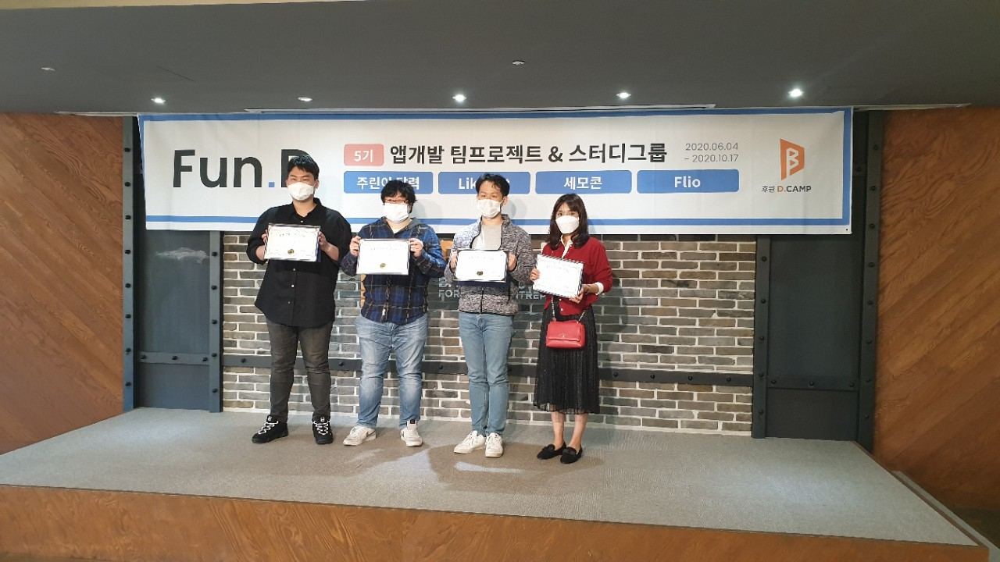
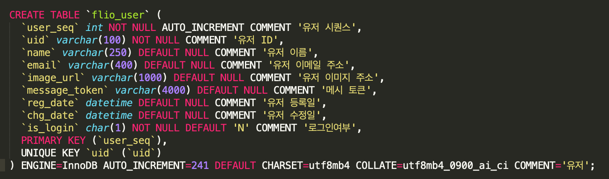
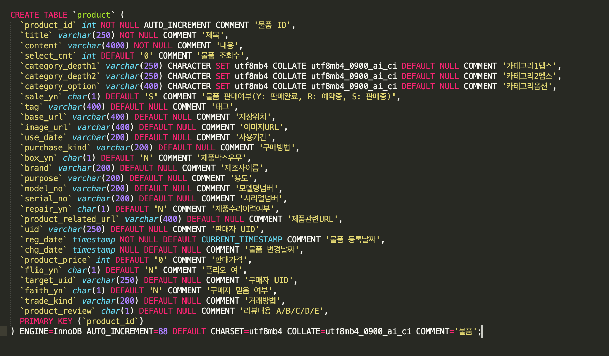
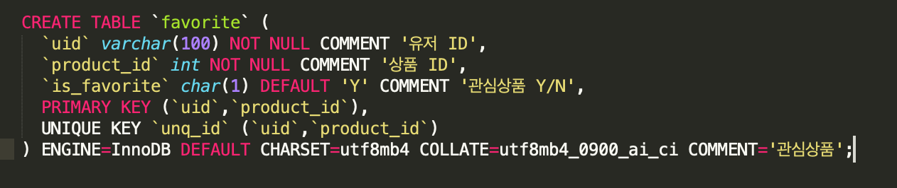
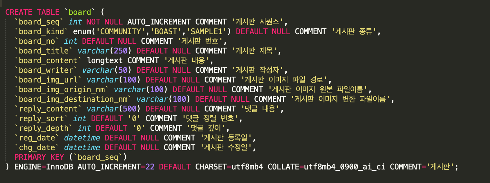
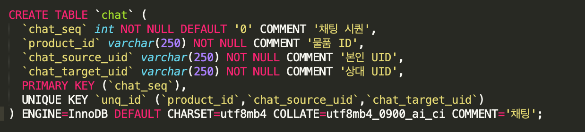
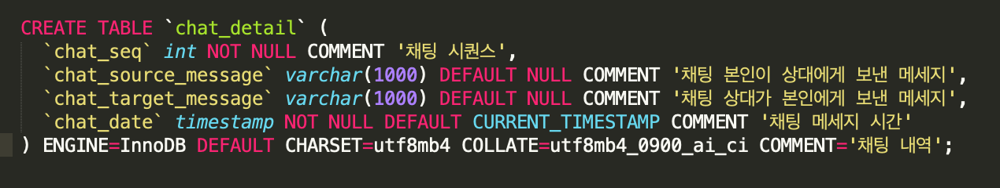
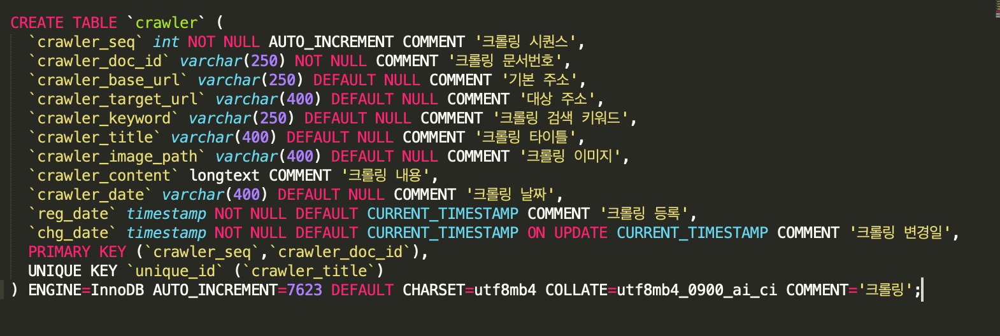

# FLIO
FLIO Project 오디오 중고마켓

## 팀원 구성
- 안드로이드 개발자 : 이승철(https://github.com/slee8789)
- 서버 개발자 : 이준명(https://github.com/mertyn88)
- 디자이너 : 오채윤
- 기획 : 이효성, 황교욱



## 작업 내역 노션 URL
> https://www.notion.so/FLIO-158db3cc5b224daeb16e8596254202f0

## 기획 피그마 URL
> https://www.figma.com/file/AmAQuoAYR4hSqOkJVUXanU/%ED%94%8C%EB%A6%AC%EC%98%A4-%ED%94%84%EB%A1%9C%EC%A0%9D%ED%8A%B8?node-id=0%3A1

## Backend - api-manager
> https://app.swaggerhub.com/apis/mertyn88/api-manager/1.4
> https://github.com/mertyn88/api-manager

## Backend - crawler-manager
> https://github.com/mertyn88/crawler-manager

### DB 설계 
  
## flio_user - 로그인 유저 정보(파이어베이스)


## product - 상품


## favorite - 관심상품


## board - 게시판 ( 댓글 +)


## chat - 채팅 (대분류)


## chat_detail - 채팅 상세


## crawler - 네이버 포스트 검색엔진 수집 데이터



### Elasticsearch

## Index 설정
> highlight 검색이 가능하도록 term_vector: "with_positions_offsets" 설정을 추가
```json
{
  "settings": {
    "index": {
      "number_of_shards": 1,
      "number_of_replicas": 0,
      "analysis": {
        "analyzer": {
          "nori_analyzer": {
            "type": "nori"
          }
        }
      }
    }
  },
  "mappings": {
    "properties":{
      "base_url":{
        "type":"keyword"
      },
      "target_url":{
        "type":"keyword"
      },
      "keyword":{
        "type":"keyword"
      },
      "title":{
        "type":"text",
        "analyzer": "nori_analyzer",
        "term_vector": "with_positions_offsets"
      },
      "content":{
        "type":"text",
        "analyzer": "nori_analyzer",
        "term_vector": "with_positions_offsets"
      },
      "image_path":{
        "type":"keyword"
      },
      "reg_date":{
        "type":"date"
      },
      "chg_date":{
        "type":"date"
      }
    }
  }
}
```

## 검색 질의
> highlight 검색이 가능하도록 관련 설정 추가 
```json
{
  "_source": {
    "excludes": [
      "content"
      ]
    }, 
  "query" : {
    "match": {
      "content": "마크 레빈슨"
    }
  },
  "highlight" : {
    "fields" : {
      "content" : {
          "pre_tags" : ["<HS>"], 
          "post_tags" : ["</HE>"], 
          "number_of_fragments" : 1,
          "fragment_size" : 150,
          "type" : "fvh"
      }
    }
  }
}
```
