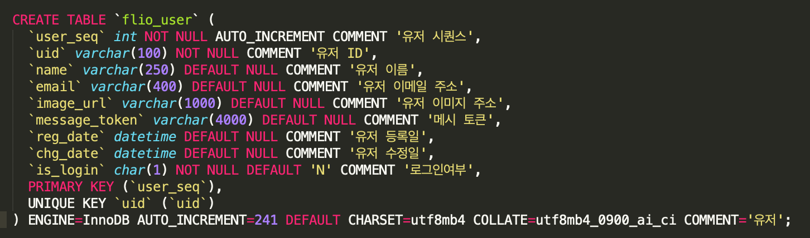
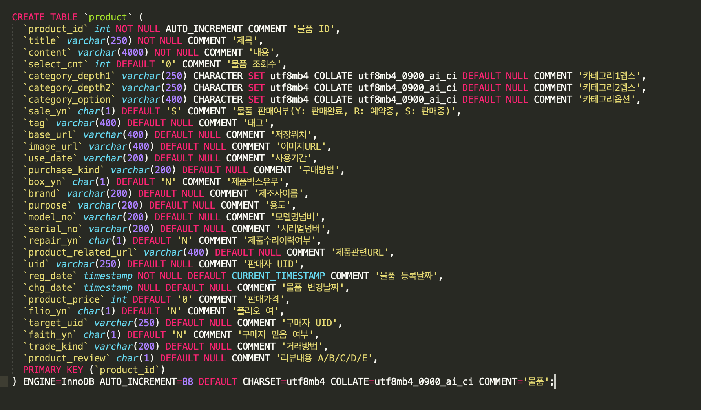
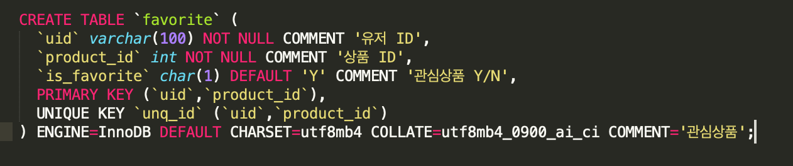
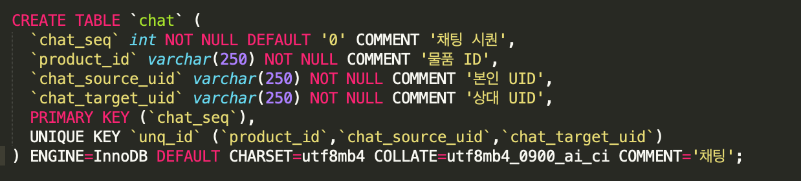
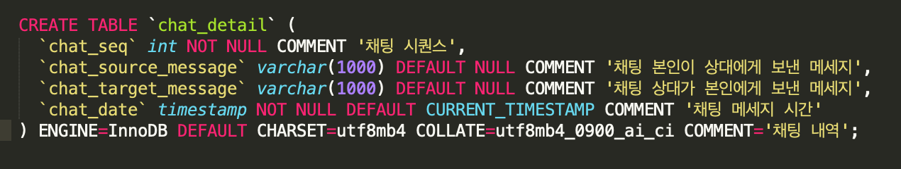
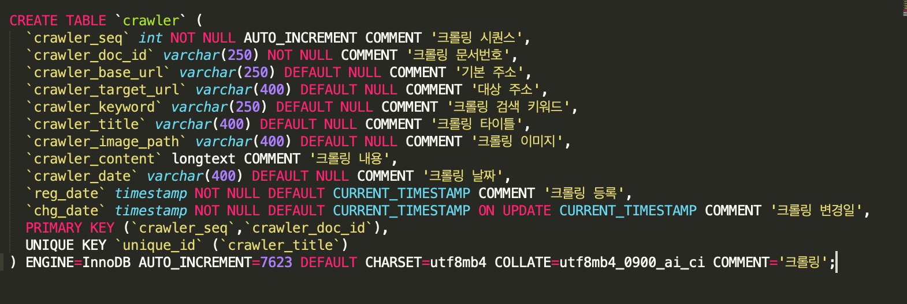

# FLIO
FLIO Project 오디오 중고마켓

## 팀원 구성
- 안드로이드 개발자 : 이승철(https://github.com/slee8789)
- 서버 개발자 : 이준명(https://github.com/mertyn88)
- 디자이너 : 오채윤
- 기획 : 이효성, 황교욱

## 작업 내역 노션 URL
> https://www.notion.so/FLIO-158db3cc5b224daeb16e8596254202f0

## 기획 피그마 URL
> https://www.figma.com/file/AmAQuoAYR4hSqOkJVUXanU/%ED%94%8C%EB%A6%AC%EC%98%A4-%ED%94%84%EB%A1%9C%EC%A0%9D%ED%8A%B8?node-id=0%3A1

## Application Version
- minSdkVersion : 23
- targetSdkVersion : 29

## Server Version
- JDK : Java 11
- Mysql : 8.20
- SpringBoot : ??

## 이번 프로젝트를 통해 얻고자 하는 기술 스택 목록
- AAC(Navigation, LiveData, DataBinding, viewModel)
- Firebase(Authentication, Crashlytics, Analytics, Cloud Messaging)
- RxJava(version 3), RxAndroid
- Dagger2, Retrofit2, Glide, TedPermission, DiffUtil, MotionLayout, CoordinatorLayout

### DB 설계 
  
## flio_user - 로그인 유저 정보(파이어베이스)

## product - 상품

## favorite - 관심상품

## board - 게시판 ( 댓글 +)

## chat - 채팅 (대분류)

## chat_detail - 채팅 상세

## crawler - 네이버 포스트 검색엔진 수집 데이터

